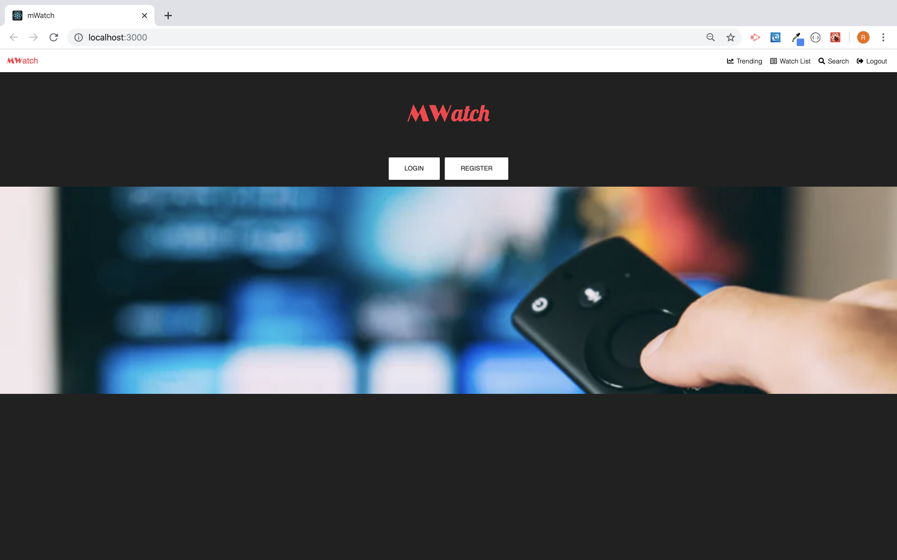
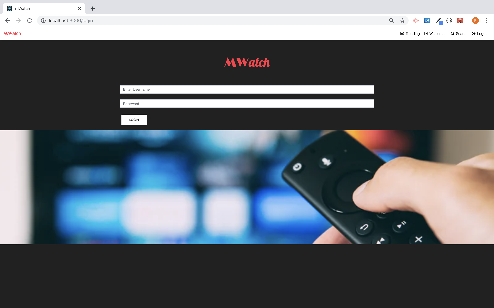
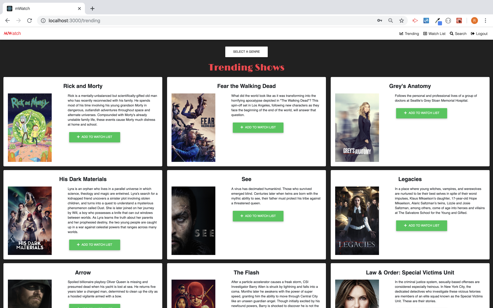
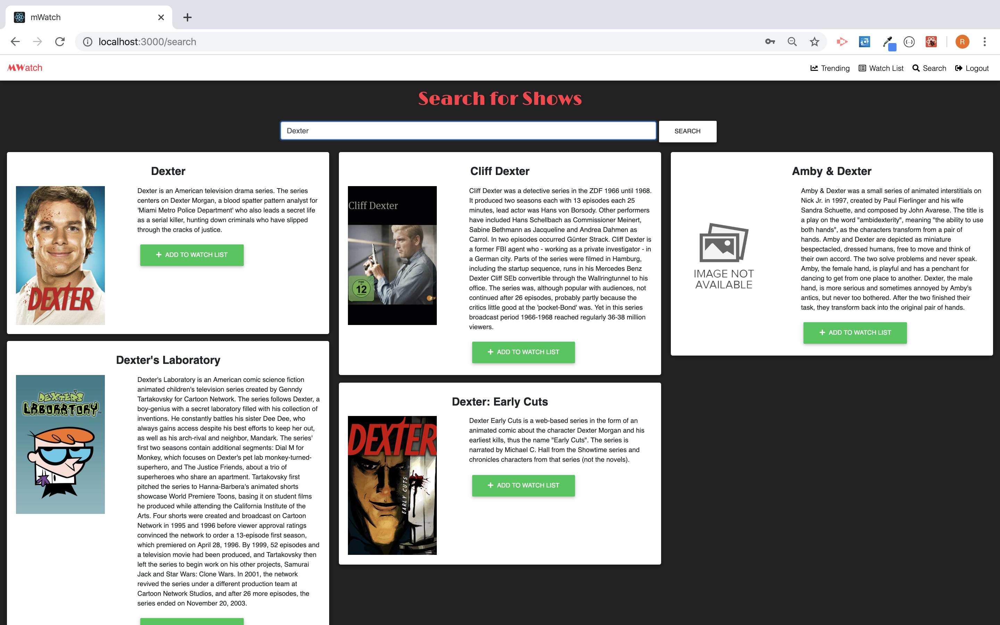
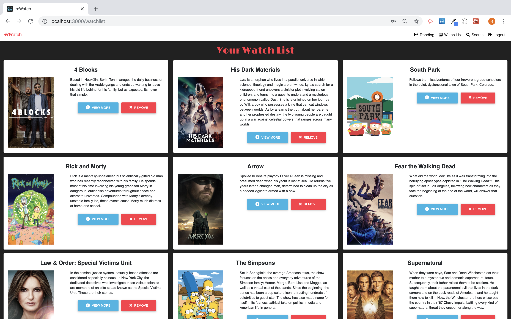

# mWatch

mWatch is a webiste that allows users to search for TV shows and add them to a watch list. Users can then view more information to see where to watch their favorite shows or add comments for everyone to view.

## Inspiration for the application
mWatch was created by two amazing developers **Michelle Mesorana** and **Ryan Goderis** who were tired of switching back and forth from an seemingly endless supply of streaming services and just simply wanted to know where to watch their favorite shows.

## Walk through of mWatch

## Landing Page

Users be given the option to visit the sign up page if they are a new user or the sign in page if they are a returning user.

## Sign In/Sign Up

Here the user will enter in their username and password and through *Passport* the user will be verified and be redirected to **Trending page**.

## Trending Page

Once here the user can see most trending TV shows as well as the highest rated shows by genre.

## Search Page

If a user wants to search for a specific show then they can visity the **Search Page** and search directly for any TV show.

## Watch List

At both the **Trending** and **Search** pages if the user sees a show they want to watch then they can add it to their **Watch List**.  Here the user can see what shows they have on their watch list, delete a show from the list, or view more information for a specific show.

## Show Page

If a user decides to view more information they are taken to the **Show Page**.  Here the user sees more detailed information including the where to watch feature.  The user can also see any comments any other user has left for that show as well as leave a comment themself.

## Visit mWatch
[mWatch](https://mwatch.herokuapp.com/)

